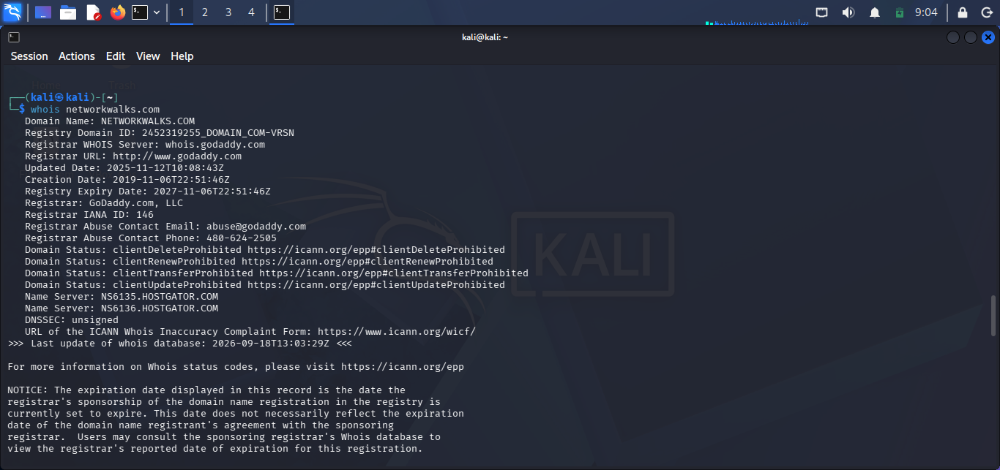
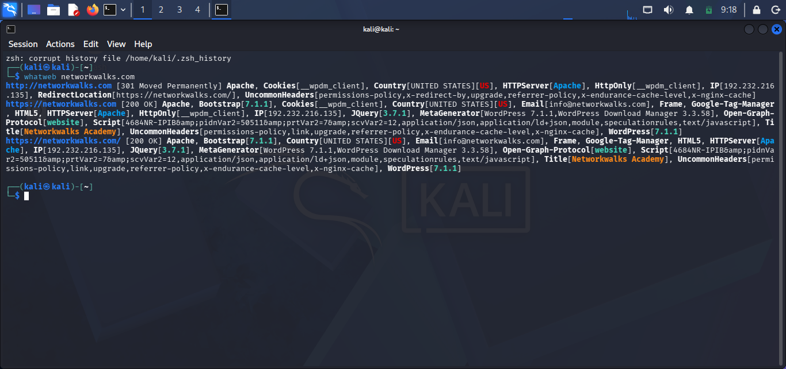
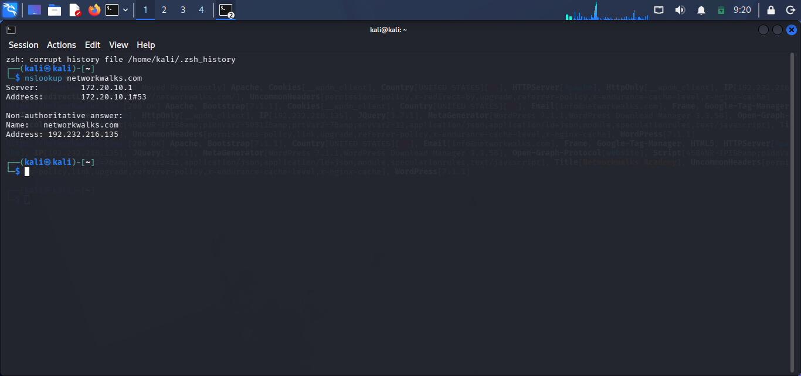

## NETWORKWALKS-B083F-WK2-PM1-PENETRATION-TESTING-REPORT

## PENETRATION TESTING REPORT

## FOOTPRINTING & NETWORK SCANNING PHASES
WK2-PM1|CYBERSECURITY|NETWORKWALKS
| Pentester Name (Cybersecurity Professional)| Balogun Esther |
|---------------------------------------------|---------------|
| Program/Batch| B083-NetworkWalks | 
| Date | 18th September 2026|
|Modules Completed | 1. WK2-PM1 (Multiple Kali Tools)|
|  | 2. W2-PM4 (theHarvester scanning) |
|  | 2. W2-PM5 (zenmap scanning) |
| Clear/Target | 1. Networkwalks (secured written permission already) |
| | 2. My own local LAN Network. |
| Permission secured from client? | Yes | 
| Phases covered | Phase 1: Reconnaissance & Footprinting |
| | Phase 2: Scanning & Network Discovery |
| | Phase 3: In progress |

## 1. Liability Disclaimer.
I performed these penetrating testing only on the systems & devices where I had secured written permission or the devices/systems that I own myself. All these materials are for education and research purposes only and not for personal use. Do not use anything from here to break the law. The Instructor, the author(s) and NetworkWalks are not responsible for what you do with this knowledge. Every action you take is for your own responsibility. Misuse of these resources can lead to criminal charges, heavy fines, loss of your job and a permanent criminal record. In most countries unauthorized access is a crime even when nothing is damaged.

## 2. Introduction.
This report expressly covers footprinting the networkwalks.com domain using multiple Kali Linux tools(WK2-PM1) and scanning my own local network with Zenmap (WK2-PM5). Module one covers the footprinting phase while module 5 covers the scanning phase, so together they show how an attacker moves from gathering public information to mapping out live hosts on a computer's network. 
For the footprinting phase, all commands were run in Kali Linux and for the scanning phase, Zenmap was installed on Windows PC. The steps listed below shows the exact command used, my observation, multiple screenshots as evidence and finally a short note on why the findings matter from an attacker's point of view.

## 3. Tools Used.
This table lists each tools used in this project and also its purpose in the project.
| Tool | Purpose |
|------|---------|
| Kali Linux & Windows | Operating systems used for reconnaissance ( gathering information) activities |
| WHOIS| Used to find domaim registration details (owner, dates, name servers, registrar url)
| whatweb| Fingerprint web technologies (server, email, IP, plugins, CMS)|
| nslookup| Domain name resolve to IP address using DNS |
| curl -l | Reads HTTP response headers of the website. |
| wafw00f| Detects if a Web Application Firewall protects the site |
| dnsrecon| Highlights all DNS records (NS, MX, SRV, SPF, TXT, SOA)|
| theHarvester| Collects publicly available information such as email addresses, subdomains, hostnames, IP addresses and other OSINT data related to a target domain|
| Zenmap (Nmap GUI)| Scans local subnet to find live hosts, IPs|
| Windows CMD| Local IP and MAC address identification|

## 4. Activities Performed.

### 4.1 Footprinting & Reconnaissance.
I performed an active reconnaissance against the networkwalks.com domain using six Kali Linux tools: **WHOIS,** **WhatWeb,** **Nslookup,** **Curl,** **Wafw00f** and **DNSRecon.** Each tool was used for different and specific collection of information about the target.

**WHOIS** was used to view publicly available registration information and also identify the domain's name servers. The result of this reconnaaissance provided detailed information about domain registration, expiry date and hosting infrastructure.

**WhatWeb** identified the technologies used by networkwalks.com website. The results identified **WordPress 7.1**, **WP Download Manager 3.3.58**, email addresss **info@networkwalks.com** amongst other information exposed by the website.

**Nslookup** helped to resolve domain name to its IP address. The result provided is **192.232.216.135**

**Curl** with -i was used to inspect the HTTP response headers. This gave additional information about the web application and explosed the WordPress REST API endpoint /wp-json/wp/v2/pages/53.

**Wafw00f** helped to determine if a Web Application Firewall was protecting the website. Result showed **ModSecurity (SpiderLabs).**

Finally, **DNSRecon** was used to highlight DNS records. The results gave information showing name servers, mail servers, SPF/TXT records, service records and DNS software information.
4.2 Reconnaissance with theHarvester

The second activity involved using theHarvester to gather publicly available information about a target domain.

Baidu Search

I first used theHarvester with Baidu as the selected data source:

theHarvester -d microsoft.com -l 1000 -b baidu

The scan returned:

[*] Target: microsoft.com
[*] Searching Baidu.
[*] No IPs found.
[*] No emails found.
[*] No people found.
[*] Hosts found: 5

The five hosts discovered were:

account.microsoft.com
demo.wd.microsoft.com
fabric.microsoft.com
serviceshub.microsoft.com
support.microsoft.com

This demonstrated how theHarvester can identify publicly available hosts and subdomains associated with a target domain.

Multiple Search Sources

I also ran theHarvester using multiple available search sources:

theHarvester -d microsoft.com -l 50 -b all

During this scan, several sources reported that their required API keys were missing. These included sources such as:

* Bevigil
* Bitbucket
* BufferOver
* BuiltWith
* Brave Search

Because the required API keys were not configured, those individual sources could not complete their searches.

However, this was also a useful part of the practical because it demonstrated that some theHarvester data sources require API credentials before they can be used.

Observation

The theHarvester exercise showed how reconnaissance tools can collect publicly available information about a domain without directly accessing or exploiting the target.

The main successful result from the Baidu search was the discovery of five hosts associated with microsoft.com, while no IP addresses, email addresses or people were returned by that particular source.
No exploitation or unauthorized access was performed during this activity.

### 4.3 Network Scanning with Zenmap.
For the second activity, Zenmap was used to identify network discovery on my local network. Requirements for this practice include; identification of my local IP address and subnet, discovering live hosts, identifying their IP and MAC addresses and generating a network topology.

Firstly, I opened the windows command prompt and typed ipconfig on my windows terminal to identify my local IP address and LAN subnet. I typed the IP address in Zenmap and ran  a **ping scan** to identfy active hosts.
The scan identified three live hosts;
   * 10.0.0.1
   * 10.0.0.15

After completing the scan, I clicked on the Topology icon displayed on Zenmap, enabled the legend and saved my network topology in PDF format as required by the practical task. I also too a screenshot for easy access.

## 5. Risk Analysis / Impact.
Based on the information gathered during the footprinting and network scanning activities, I identified the following potential risks.
| S/N | Risk/Findings | Evidence/Observation | Potential Impact | Risk Level |
|-----|---------|--------|---------|-------|
|1| Website technology information exposed | WhatWeb identified WordPress and WP Download Manager | Threat actors could use the exposed version information to identify software that requires security patch |  🟠 |
| 2 | Server IP address identifiable | Nslookup resolved the domain to 192.232.216.135 | Provides information about the network location of the web service | 🟡 |
| 3 | HTTP technical information exposed | Curl returned HTTP response headers and exposed /wp-json/wp/v2/pages/53 | May assist technology fingerprinting and further enumeration | 🟡 |
| 4 | WAF technology identifiable | Wafw00f identified ModSecurity (SpiderLabs) | Reveals information about the web application's security architecture | 🟡 |
| 5 | DNS infrastructure information exposed | DNSRecon identified DNS, mail and service-related records | DNS information can help build a broader infrastructure profile |  🟠 |
| 6 | Publicly discoverable hosts | theHarvester identified five hosts associated with microsoft.com | Publicly discoverable subdomains/hosts may provide additional information about an organization's external attack surface |  🟡 |
| 7 | Multiple live hosts visible on local network | Zenmap identified three live hosts in the example network | Unauthorized devices may be potentially present on a network |  🟠 |

#### Risk level key: 🔴 High 🟠 Medium 🟡 Low 

The risks above are observations from the footprinting and scanning exercises not from confirmed vulnerabilities.

The practical exercises basically involved information gathering and host discovery. No exploitation or vulnerability validation was performed as part of these three modules.

Therefore, the presence of information such as a software version, IP address or DNS record does not exactly mean that the system itself is vulnerable. Further authorized security testing would be required to confirm any actual vulnerability.

## 6 Recommendations.
Based on the observations from these activities, the following security improvements are recommended:

  1. **Publicly exposed technology information should be reviewed.**
     Organizations should conduct a regular review of the information about their website technologies, plugins, CMS platforms and server configuration to ensure unnecessary technical details are not exposed.
  2. **Software Update**
     CMS platforms, plugins and other web technologies should be regularly updated and reviewed for any necessary security patch.
  3.**HTTP Headers Review**
     HTTP headers should also be reviewed and properly configured to minimize unnecessary technical information that could assist further reconnaissance.
  4. **Regular DNS Records Review**
    DNS records should be periodically reviewed to ensure that only required records, services and infrastructure information are publicly exposed.
  5. **Proper Configuration and Monitoring of the WAF**
     Keep the WAF (ModSecurity) enabled and tuned, since it already blocks naive attacks.
  6. **Regular Internal Network Discovery**
     Organizations should periodically scan their authorized internal networks to identify active devices and maintain an accurate inventory of connected systems.
  7. **Investigate Unknown Devices**
     Any unfamiliar device identified during an authorized network scan should be investigated and verified to determine whether it is an approved device.
  8. **Perform Security Testing with Authorization**
     Reconnaissance and scanning should only be performed against systems and networks where appropriate      authorization has been provided.

## 7. Conclusion.
During Week 2 of my Cybersecurity & Ethical Hacking Internship, I had hands-on experience spanning across footprinting, reconnaissance and network scanning.

For the first activity, I used multiple Kali Linux tools including WHOIS, WhatWeb, Nslookup, cURL, Wafw00f and DNSRecon to gather information about the authorized target domain. I learned how each tool provides a different type of information, from domain and DNS details to web technologies, HTTP headers and WAF identification.

I also used theHarvester to collect publicly available information about a domain. The exercise helped me understand how reconnaissance can reveal hosts and subdomains that may form part of an organization’s external attack surface. In my practical, five hosts were identified from the Baidu search, while no IP addresses, email addresses or people were returned by that particular source.

For the network scanning activity, I used Zenmap to scan my own local network and identify active hosts. I also worked with Windows CMD to identify my local network configuration and used Zenmap’s topology feature to visualize the discovered network.

One of my major takeaways from these exercises is that information gathering is an important part of cybersecurity. Before any exploitation takes place, a security professional can learn a lot by carefully examining publicly available information and understanding how systems and networks respond to different requests.

I also learned the importance of proper documentation. A good security report should clearly explain what was tested, what was discovered, the potential impact of the observations and the recommended security improvements.

Most importantly, these practical exercises reinforced that reconnaissance and network scanning must always be performed within an authorized scope. 

All activities documented in this project were carried out as part of an assigned educational cybersecurity exercise or on systems and networks for which I had permission.

## 8. Evidences Collected.

👤 **Author**
**Dasola Olaopa**

Cybersecurity Professional B083A

LinkedIn: https://www.linkedin.com/in/olaopadasola

📌 **Project Information**
**Project Information:** Cybersecurity Program at NetworkWalks | Week: 02 : Repository: GitHub

